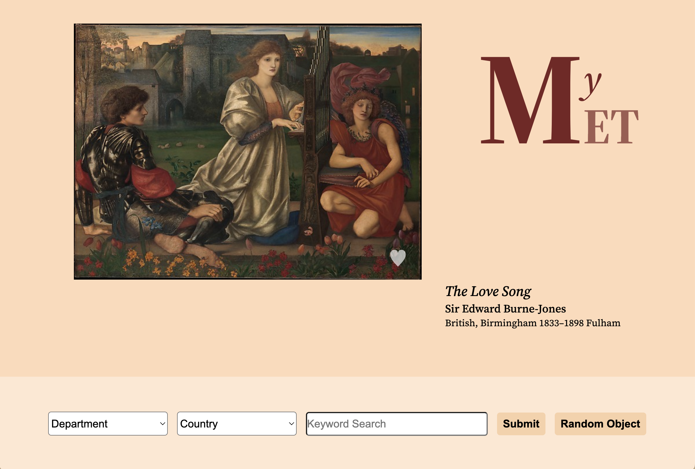
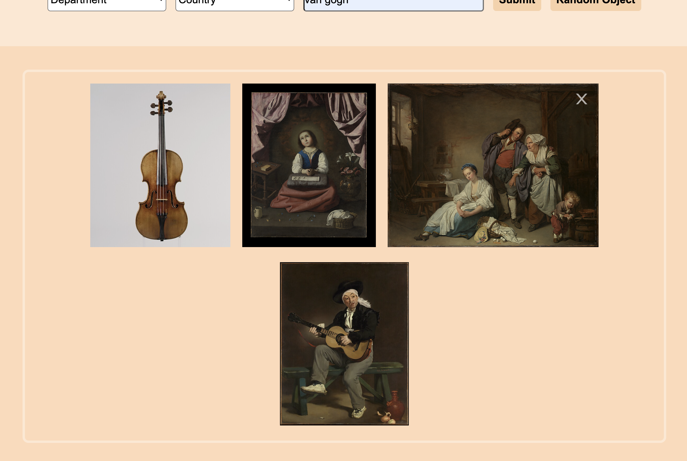

# MyMet

A lightweight and eminently-clickable view into the collection of the Metropolitan Museum of Art.

## MVP

This website is a viewer / portal for the Metropolitan Museum of Art collection. Selecting for European country names, or common keywords such as 'flower', 'child', or 'vase' turns up an extremely large selection of results. More specific searches, or modern country names, turn up fewer results due to the nature of the catalog metadata.

Upon initial pageload, the user is shown randomized painting from the collection. The user can like this item, add it to their gallery below, or click 'Random Object' to see another work. There is a search box that can be filled in with Department, Country of Origin, or a keyword search.

Within the results view, the user can like images or (if more than 18 results are available) click to see further results. Selecting items in the search or gallery boxes will bring up a larger view of the artwork, which can be dismissed by clicking outside the frame.

## Technical Details

This project is realized completely in functional JavaScript.

The [MET Museum API](https://metmuseum.github.io/) has two query modalities: an object endpoint, which takes a 5-6 digit ID number and returns the associated record, or a search query endpoint, which returns a list of object IDs that match the query. We build a query string based on the user input--specifying only records that have images--then iterate over the resulting list, passing these to helper functions to style and display the results.

User likes are stored as a stringify'ed array in the browser local storage. This information persists across sessions on the same device.

## Challenges

- Despite including the `hasImages=true` query tag by default, the API will often return records with image URLs missing due to licensing restrictions. We remove these records in the rendering phase. This explains to some degree the dearth of modern art and sculpture in our results.
- With the goal in mind of creating and extremely simple interface, we left ouf many possible search parameters (such as the age of the work). These could be implemented at a later time.
